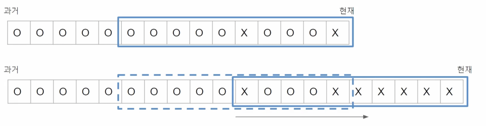
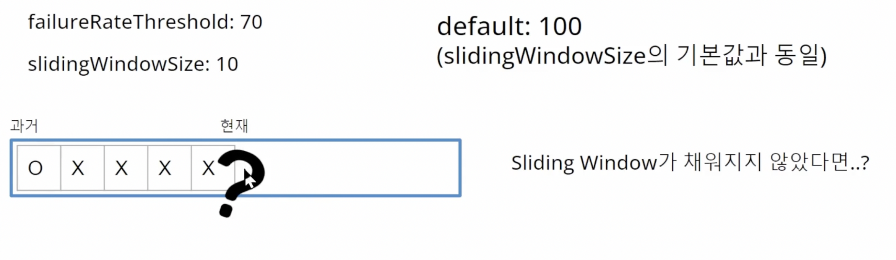

## CircuitBreaker주요 설정 및 설명

#### SlidingWindowType

`Sliding Window`는 COUNT_BASED가 default설정이고 TIME_BASED설정도 있음

횟수를 기준으로 sliding window를 지정하는것이 COUNT_BASED 타입

#### SlidingWindowSize

windowSize는 default가 100

윈도우 사이즈가 100 이면 100개의 요청의 성공과 실패를 기준으로 서킷브레이커의 상태를 변경하는데 판단함.

만약 timebased라면 windowSize는 초(second)

#### failureRateThreshold

슬라이딩 윈도우에서 몇%를 실패해야 서킷이 열릴지 기준치. default는 50

#### minimumNumberOfCalls

슬라이딩 윈도우의 사이즈가 10이고 실패 임계치가 70인데 윈도우가 채워지지 않은 상태라고 해보자

슬라이딩 윈도우가 가득 차지 않았기에 아직 서킷의 상태를 변경하고 싶지 않다. 그렇다면 minimumNumberOfCalls이 옵션을 두는 것이다.

minimumNumberOfCalls를 두면 해당 갯수를 넘어간 요청부터 윈도우 사이즈의 실패율을 계산한다. default는 100 

`주의할점은 sliding window보다 큰 값으로 지정하면 당연히 의미가 없다 `
